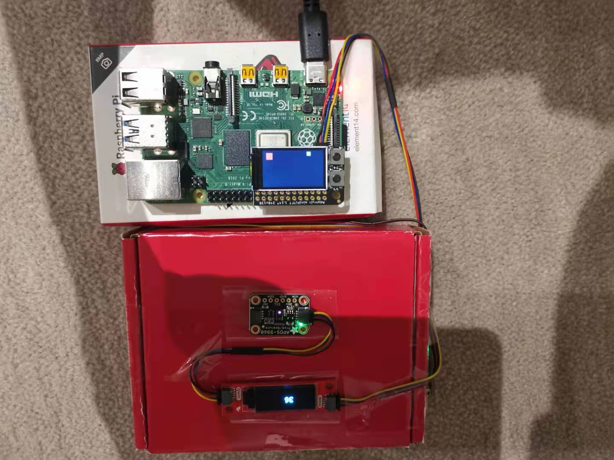
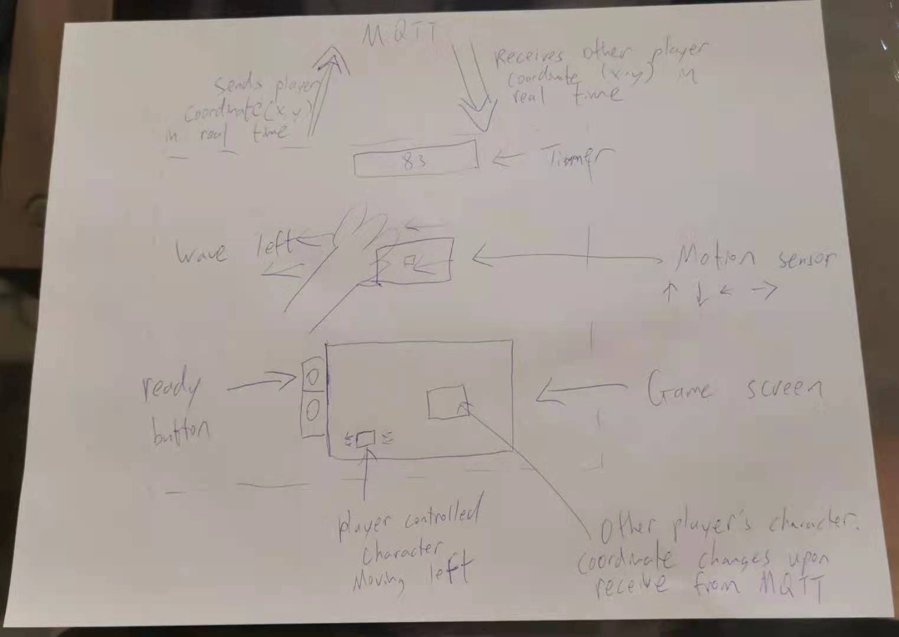
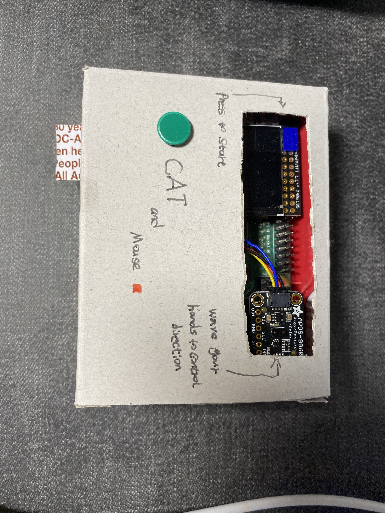
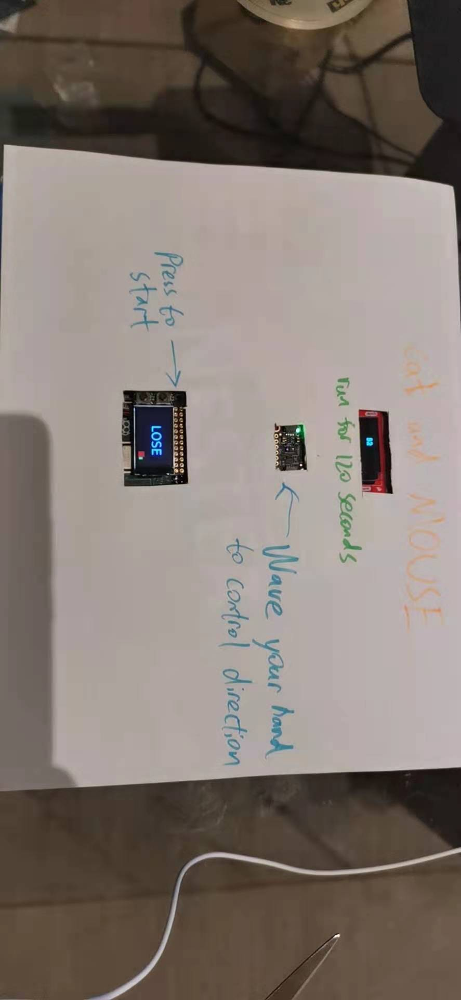

## Deliverables

1. Documentation of design process
2. Archive of all code, design patterns, etc. used in the final design. (As with labs, the standard should be that the documentation would allow you to recreate your project if you woke up with amnesia.)
3. Video of someone using your project (or as safe a version of that as can be managed given social distancing)
4. Reflections on process (What have you learned or wish you knew at the start?)

## Teams

Jianang Wang & Hangyu (John) Lin

# Cat and Mouse - Description

We would like to introduce you to our Cat and Mouse game.

It is a two players game, where each player controls a square on the screen.

One player try to catch the other player, while the other player tries to run away for 120 seconds.

The two players can be anywhere in the world and be able to challenge each other on their Raspberry Pi.

## Setup

Since this is a two-player game, both of the players need to have the same setup.
1. A Raspberry Pi for central control.
2. A LED display to show the game.
3. A OLEED display for in-game timer.
4. A gesture sensor for player to control in-game character.
5. A MQTT server for data transmission.

This is how we connect the device and the displays under the hood

## Design

We designed this game to be a two-player game - anyone who installed the game will be able to play no matter where he/she locates. We think this is a good interactive design for people to kill some time and make some friends.

For players, the interaction is pretty easy - two players will discuss the role they want to play in advance, one plays as cat and the other as mouse. The game will be ready after two players both click the ready button on their LED screen, then "cat" will have 120 second to catch the "mouse". Both players need to use the gesture sensor to control their character, wave their hand to the same direction as they wish to movee their characters. The character will continue to move in the same direction until it hits the wall or receives a new command from the player. Cat wins if cat successfully caught the mouse in 120 seconds, and mouse wins otherwise.

For development, we set up two separate MQTT channels to update two players' real time locations. Player will control their character by gesture locally on their Pi and then send this information to the MQTT server. The other player will retrive this data from the server and draw the opponent accordingly.

This is the CAT device.

This is he MOUSE device. The mouse device has a LED screen that shows a timer that counts to 120 seconds.

## Demo

This is a demo video of how the game is played:

https://www.youtube.com/watch?v=8TfllM4XiLg&t=2s

## Reflection

After playing around with the device, we found it is more interesting than we expected it to be. The game is very intense to play, and people can use different strategies to trick their opponents. The gesture sensor sometimes are not very sensitive and players may need to wave their hands multiple times in order to move toward the direction as intended - We also tried to replace the gesture sensor with a joystick, but we found the insensitivity added more fun to the game and people can get some exercise from it.

For future improvements, we think it would be fun to have a bigger LED screen so that we can add some pre-made maze maps so that players can come up with more strategies. We could have also tried different ways for our devices to communicate to prevent lags. Adding more players into the game would also be a good idea, where 1 cat player would try to catch multiple mouse players at the same time.
