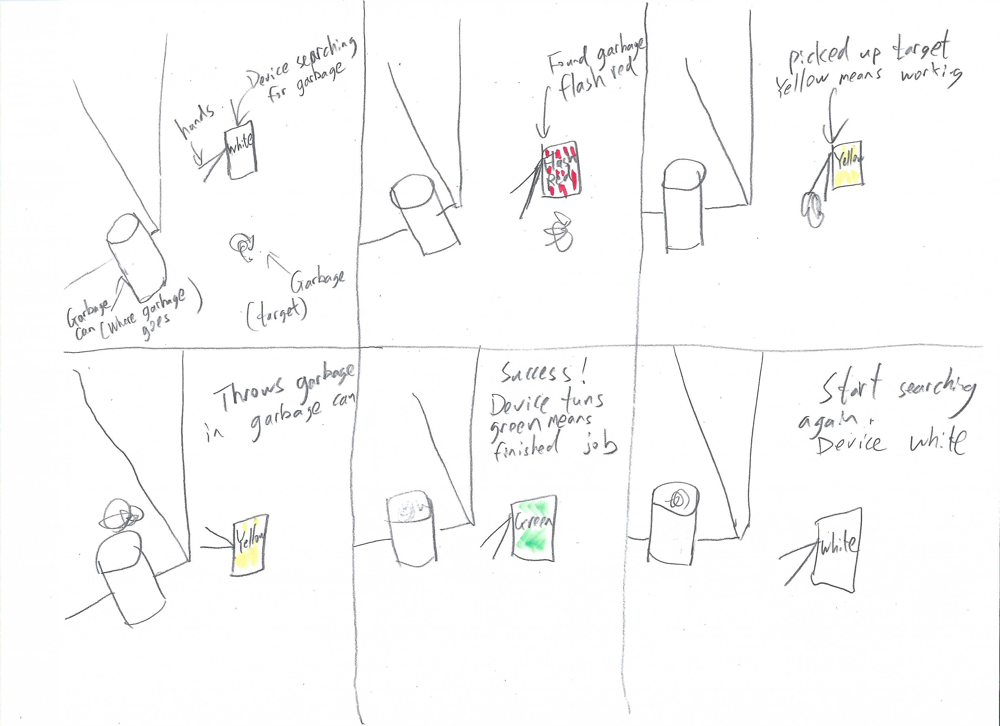
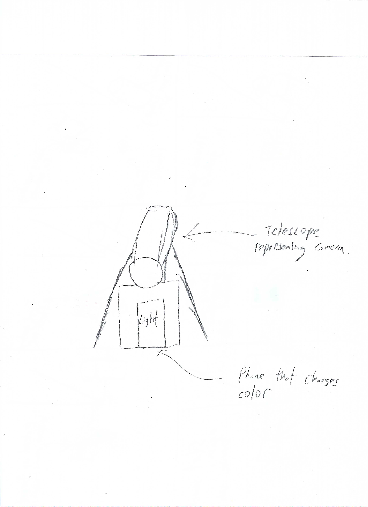

# Staging Interaction

In the original stage production of Peter Pan, Tinker Bell was represented by a darting light created by a small handheld mirror off-stage, reflecting a little circle of light from a powerful lamp. Tinkerbell communicates her presence through this light to the other characters. See more info [here](https://en.wikipedia.org/wiki/Tinker_Bell). 

There is no actor that plays Tinkerbell--her existence in the play comes from the interactions that the other characters have with her.

For lab this week, we draw on this and other inspirations from theatre to stage interactions with a device where the main mode of display/output for the interactive device you are designing is lighting. You will plot the interaction with a storyboard, and use your computer and a smartphone to experiment with what the interactions will look and feel like. _Make sure you read all the instructions and understand the whole of the laboratory activity before starting!_

## Prep

1. Set up [your Github "Lab Hub" repository](../../../) by [following these instructions](https://github.com/FAR-Lab/Developing-and-Designing-Interactive-Devices/blob/2021Spring/readings/Submitting%20Labs.md).
2. Set up the README.md for your Hub repository (for instance, so that it has your name and points to your own Lab 1) and [learn how](https://guides.github.com/features/mastering-markdown/) to post links to your submissions on your readme.md so we can find them easily.

### For lab, you will need:

1. Paper
1. Markers/ Pen
1. Smart Phone--Main required feature is that the phone needs to have a browser and display a webpage.
1. Computer--we will use your computer to host a webpage which also features controls
1. Found objects and materials--you’ll have to costume your phone so that it looks like some other device. These materials can include doll clothes, a paper lantern, a bottle, human clothes, a pillow case. Be creative!
1. Scissors

### Deliverables for this lab are: 
1. Storyboard
1. Sketches/photos of costumed device
1. Any reflections you have on the process.
1. Video sketch of the prototyped interaction.
1. Submit these in the lab1 folder of your class [Github page], either as links or uploaded files. Each group member should post their own copy of the work to their own Lab Hub, even if some of the work is the same for each person in the group.

## Overview
For this assignment, you are going to 

A) [Plan](#part-a-plan) 

B) [Act out the interaction](#part-b-act-out-the-interaction) 

C) [Prototype the device](#part-c-prototype-the-device)

D) [Wizard the device](#part-d-wizard-the-device) 

E) [Costume the device](#part-e-costume-the-device)

F) [Record the interaction](#part-f-record)

## The Report
This readme.md page in your own repository should be edited to include the work you have done. You can delete everything but the headers and the sections between the **stars**. Write the answers to the questions under the starred sentences. Include any material that explains what you did in this lab hub folder, and link it in the readme.

Labs are due on Mondays. Make sure this page is linked to on your main class hub page.

## Part A. Plan 
**Describe your setting, players, activity and goals here.**
For this lab, the main idea for my interactive device is to have a device that will help keep your workspace clean. The setting will be in my study room, somewhere near my garbage can. The players would be the garbage that would show up on the ground, the device will interact with the garbage. The avtivity would be to have the device detect the garbage, move to the garbage and pick it up, then throw it into the garbage can. The goal is to have the garbage in the garbage can when its detected by the device.

Sketch a storyboard of the interactions you are planning. It does not need to be perfect, but must get across the behavior of the interactive device and the other characters in the scene. 
**Include a picture of your storyboard here**

Present your idea to the other people in your breakout room. You can just get feedback from one another or you can work together on the other parts of the lab.
**Summarize feedback you got here.**
My group thought that it was a very good idea, however, it would be very hard to act out the interaction without a second person acting as the device to pick up and accurate throw in the garbage while I record and adjust the lighting.

## Part B. Act out the Interaction

Try physically acting out the interaction you planned. For now, you can just pretend the device is doing the things you’ve scripted for it. 

**Are there things that seemed better on paper than acted out?**
It was impossible for me to pretend to be the device to go and pick up the garbage and also change the lighting. I cannot be controlling the device and also work on my laptop at the same time, my arms does not stretch out that far.

**Are there new ideas that occur to you or your collaborators that come up from the acting?**
A new idea occured to me. Instead of haveing the device move and go interact with the garbage, I would have the device detect new garbage on the ground, change the lighting to red to warn me to go pick up the garbage, then the device would detect that I am picking up the garbage and change color to yellow as I am in the process of picking up and throwing the garbage in the garbage can. After the garbage is cleaned up, the device will turn green for a few second to represent success, then it would turn white as idle to detect more garbage. I would fully be able to act out this interaction myself.

## Part C. Prototype the device

**Give us feedback on Tinkerbelle.**
Easy to install and easy to use. Very simple and nothing went wrong.

## Part D. Wizard the device

**Include your first attempts at recording the set-up video here.**

https://drive.google.com/file/d/1xesvhDroNRau60zTQTj0EQLhZaFU1u1h/view?usp=sharing

Now, hange the goal within the same setting, and update the interaction with the paper prototype. 

**Show the follow-up work here.**

## Part E. Costume the device

**Include sketches of what your device might look like here.**

**What concerns or opportunitities are influencing the way you've designed the device to look?**
Just using what I had in the house. Big telescope was cool, representing the camera of the device that would provide the image to use "computer vision to detect garbage on the ground". Very cool in my opinion, simple setup.

## Part F. Record

**Take a video of your prototyped interaction.**

**Please indicate anyone you collaborated with on this Lab.**
Be generous in acknowledging their contributions! And also recognizing any other influences (e.g. from YouTube, Github, Twitter) that informed your design. 

# Staging Interaction, Part 2 

This describes the second week's work for this lab activity.

## Prep (to be done before Lab on Wednesday)

You will be assigned three partners from another group. Go to their github pages, view their videos, and provide them with reactions, suggestions & feedback: explain to them what you saw happening in their video. Guess the scene and the goals of the character. Ask them about anything that wasn’t clear. 

**Summarize feedback from your partners here.**

## Make it your own

Do last week’s assignment again, but this time: 
1) It doesn’t have to (just) use light, 
2) You can use any modality (e.g., vibration, sound) to prototype the behaviors, 
3) We will be grading with an emphasis on creativity. 

**Document everything here.**
