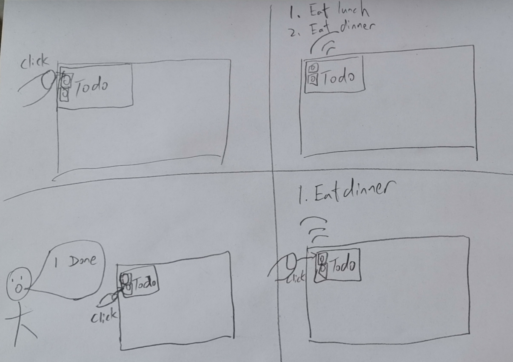

# You're a wizard, [John Lin HL2357]


In this lab, we want you to practice wizarding an interactive device as discussed in class. We will focus on audio as the main modality for interaction but there is no reason these general techniques can't extend to video, haptics or other interactive mechanisms. In fact, you are welcome to add those to your project if they enhance your design.


## Text to Speech and Speech to Text

In the home directory of your Pi there is a folder called `text2speech` containing some shell scripts.

```
pi@ixe00:~/text2speech $ ls
Download        festival_demo.sh  GoogleTTS_demo.sh  pico2text_demo.sh
espeak_demo.sh  flite_demo.sh     lookdave.wav

```

you can run these examples by typing 
`./espeakdeom.sh`. Take some time to look at each script and see how it works. You can see a script by typing `cat filename`

```
pi@ixe00:~/text2speech $ cat festival_demo.sh 
#from: https://elinux.org/RPi_Text_to_Speech_(Speech_Synthesis)#Festival_Text_to_Speech

echo "Just what do you think you're doing, Dave?" | festival --tts

```

You can also play audio files directly with `aplay filename`.

After looking through this folder do the same for the `speech2text` folder. In particular, look at `test_words.py` and make sure you understand how the vocab is defined. Then try `./vosk_demo_mic.sh`

## Serving Pages

In Lab 1 we served a webpage with flask. In this lab you may find it useful to serve a webpage for the controller on a remote device. Here is a simple example of a webserver.

```
pi@ixe00:~/$ python server.py
 * Serving Flask app "server" (lazy loading)
 * Environment: production
   WARNING: This is a development server. Do not use it in a production deployment.
   Use a production WSGI server instead.
 * Debug mode: on
 * Running on http://0.0.0.0:5000/ (Press CTRL+C to quit)
 * Restarting with stat
 * Debugger is active!
 * Debugger PIN: 162-573-883
```
From a remote browser on the same network, check to make sure your webserver is working by going to [http://ixe00.local:5000]()


## Demo

In the [demo directory](./demo), you will find an example wizard of oz project you may use as a template. **You do not have to** feel free to get creative. In that project, you can see how audio and sensor data is streamed from the Pi to a wizard controller that runs in the browser. You can control what system says from the controller as well.

## Optional

There is an included [dspeech](./dspeech) demo that uses [Mozilla DeepSpeech](https://github.com/mozilla/DeepSpeech) for speech to text. If you're interested in trying it out we suggest you create a seperarate virutalenv. 


# Lab 3 Part 2

Create a system that runs on the Raspberry Pi that takes in one or more sensors and requires participants to speak to it. Document how the system works and include videos of both the system and the controller.

## Prep for Part 2



## Share your idea sketches with Zoom Room mates and get feedback

James said that my idea was fine, but maybe add more sensors to the Pi. He also mentioned that adding a function to add new tasks to the to do list by voice would be cool. However, I think that would be really hard to do unless the speech2text is super accurate.

Andrew said that it is a great idea, very interesting application. This would help people that are not able to read from a small screen. However, maybe we can include the text on the screen while the machine is reading it outloud.

Quinn said that it is interesting. Maybe have the todo list connect to a cloud or online source to sync the todo list with other lists you have.

## Prototype your system

It is a todo list. When you press the top button, it will read and display all the items in the list. When you press the bottom button and say the number in the todo list that you finished, it will delete that item from the list.

https://drive.google.com/file/d/14JiOmGz7wtIO-Yhii1qo-ZpUPhpAVC8W/view?usp=sharing

## Test the system
Try to get at least two people to interact with your system. (Ideally, you would inform them that there is a wizard _after_ the interaction, but we recognize that can be hard.)

Jame and Karen used my device.

Answer the following:

### What worked well about the system and what didn't?
James said that my device reads the list out very well. It also display the item in text on the display while it is reading. The thing that did not work well is that my speech2text is hardcoded, the device cannot actually recognize the voice and always delete the first item in the list. Karen said that the buttons are hard to press and the text on display is a little small and fast.

### What worked well about the controller and what didn't?
The controller worked relatively well. A speaker instead of a ear bud would be nice. The buttons do not respond fast enough, you have to hold them for half a second.

### What lessons can you take away from the WoZ interactions for designing a more autonomous version of the system?
I realized that the speech2text needs to work well. It should be able to identify the words coming out the the users' mouth on first try. Also, being able to edit or add to the list would be important for a more autonomous version. Having automatic reminders would be nice too, so the user do not have to press the button to listen to the todo list.


### How could you use your system to create a dataset of interaction? What other sensing modalities would make sense to capture?
My system could capture how people prioritize their todo list by storing which items they finish first.

